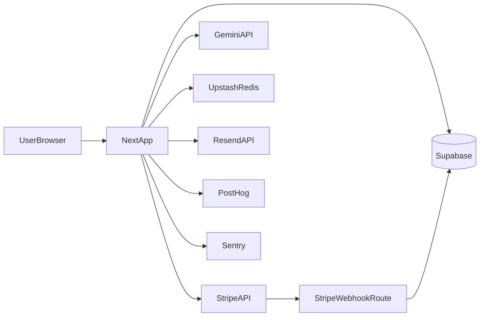

# Next.js Supabase AI SaaS Starter

[](./LICENSE)

[](https://vercel.com/new)
[](https://github.com/adarshparmar/nextjs-supabase-ai-saas-starter)

Production-ready SaaS starter built for fast shipping and real-world reliability: Supabase auth, Stripe subscriptions, Gemini-powered streaming chat, usage limits, transactional email, analytics, and monitoring.

## Screenshots

- Landing: `public/marketing-dashboard-placeholder.svg`
- Chat: `public/marketing-chat-placeholder.svg`

## Tech Stack

- **Framework**: Next.js 14 (App Router), React 18, TypeScript (strict)
- **UI**: Tailwind CSS, Framer Motion, Radix primitives, custom design system
- **Auth & DB**: Supabase Auth + Postgres + RLS + Storage
- **Billing**: Stripe Checkout + Billing Portal + Webhooks
- **AI**: Gemini (`@ai-sdk/google`) + Vercel AI SDK streaming
- **Rate limiting**: Upstash Redis + `@upstash/ratelimit`
- **Email**: Resend + React Email templates
- **Observability**: Sentry
- **Product analytics**: PostHog

## Route Map

- `/` — Marketing landing page
- `/pricing` — Public pricing and plan comparison
- `/login` — Password login
- `/signup` — Signup flow
- `/forgot-password` — Password reset request
- `/reset-password` — Password reset completion
- `/dashboard` — Dashboard overview
- `/chat` — AI chat workspace
- `/settings` — Account and profile settings
- `/billing` — Subscription and usage management

## Core Features

- Supabase authentication with profile management and avatar uploads
- Stripe subscription lifecycle (checkout, billing portal, webhook sync)
- Gemini streaming chat with persistent sessions and message history
- Per-tier usage limits + monthly tracking + rate limiting
- Branded loading/error/empty states
- PostHog analytics hooks for product events
- Sentry instrumentation for server/client error visibility
- Security headers, robots, sitemap, and OG image support

## Quick Start

```bash
git clone https://github.com/adarshparmar/nextjs-supabase-ai-saas-starter.git
cd nextjs-supabase-ai-saas-starter
pnpm install
cp .env.example .env.local
pnpm dev
```

Open [http://localhost:3000](http://localhost:3000).

## Environment Variables

Use `.env.example` as the source of truth.

- **Core**: `NEXT_PUBLIC_SITE_URL`
- **Supabase**: `NEXT_PUBLIC_SUPABASE_URL`, `NEXT_PUBLIC_SUPABASE_ANON_KEY`, `SUPABASE_SERVICE_ROLE_KEY`
- **Stripe**: `STRIPE_SECRET_KEY`, `STRIPE_WEBHOOK_SECRET`, Stripe price IDs
- **AI**: `GEMINI_API_KEY`, optional `GEMINI_MODEL_DEFAULT`, `GEMINI_MODEL_PRO`
- **Email**: `RESEND_API_KEY`, `RESEND_FROM_EMAIL`
- **Monitoring**: `SENTRY_DSN`, `NEXT_PUBLIC_SENTRY_DSN`, `SENTRY_ORG`, `SENTRY_PROJECT`
- **Analytics**: `NEXT_PUBLIC_POSTHOG_KEY`, `NEXT_PUBLIC_POSTHOG_HOST`
- **Rate limits**: `UPSTASH_REDIS_REST_URL`, `UPSTASH_REDIS_REST_TOKEN`
- **Optional dev seed**: `DEV_TEST_EMAIL`, `DEV_TEST_PASSWORD`, `DEV_TEST_NAME`

## Architecture



## Project Structure

```text
app/                  # App Router routes, API routes, layouts
components/           # Feature and UI components
lib/                  # Domain libraries (billing, stripe, supabase, email, etc.)
utils/                # Shared utility helpers (e.g. class merging)
services/             # Reserved for service-layer abstractions
types/                # Global shared types
supabase/migrations/  # SQL migrations
scripts/              # Developer scripts
```

## Setup Checklist (Production)

1. Run Supabase migrations in `supabase/migrations/`.
2. Configure Stripe products and set all `STRIPE_PRICE_*` env vars.
3. Set Stripe webhook endpoint to `/api/stripe/webhook`.
4. Configure Sentry DSN(s) and project metadata.
5. Configure PostHog key + host.
6. Set `GEMINI_API_KEY` and optional model overrides.
7. Verify auth redirect URLs in Supabase and Stripe return URLs.

## Deployment

Recommended target: **Vercel**.

- Add all env vars from `.env.example` to project settings.
- Ensure `NEXT_PUBLIC_SITE_URL` matches your production domain.
- Trigger a production deploy and validate:
  - login/signup
  - webhook delivery
  - `/chat` streaming
  - billing portal and checkout redirects

## Contributing

Contributions are welcome. Open an issue first, then submit a PR with:

- clear scope
- verification notes
- migration notes (if schema/data changes are involved)

## License

MIT. See `LICENSE`.
