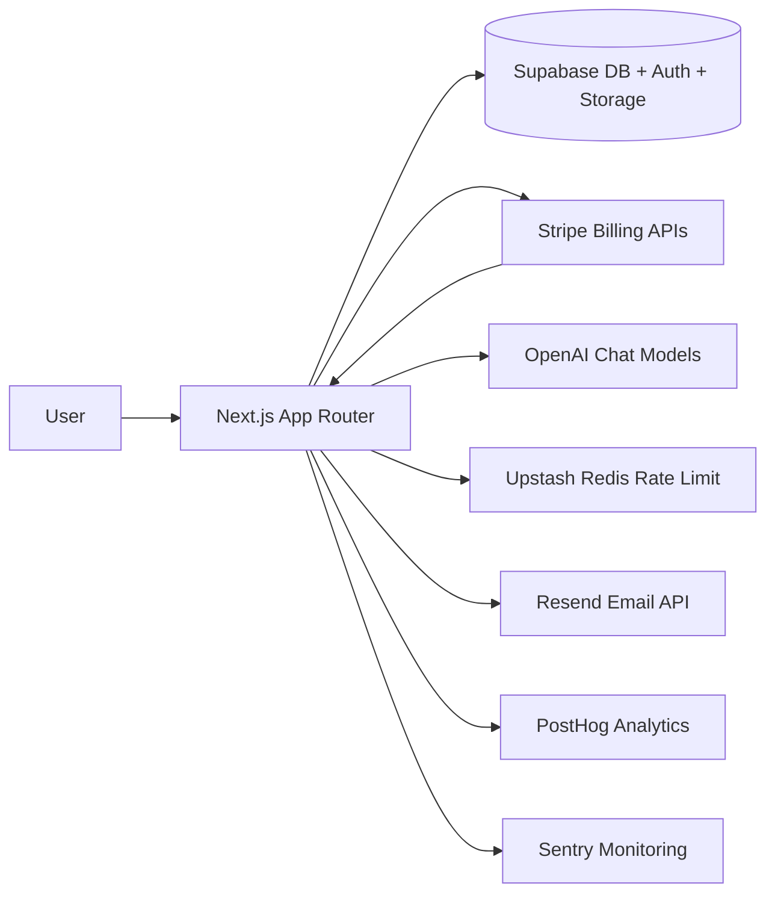

# Next.js Supabase AI SaaS Starter

[](./LICENSE)

[](https://vercel.com/new)
[](https://github.com/adarshparmar/nextjs-supabase-ai-saas-starter)

Production-ready starter to launch AI SaaS products fast: auth, billing, streaming chat, rate limits, emails, analytics, and monitoring.

## Screenshots

- Landing: `public/marketing-dashboard-placeholder.svg`
- Chat: `public/marketing-chat-placeholder.svg`

## Features

- 🚀 Next.js 14 App Router + TypeScript strict mode
- 🔐 Supabase auth + RLS + profile management + avatar storage
- 💳 Stripe subscriptions (Starter, Pro, Business) + webhook sync
- 🤖 OpenAI streaming chat with session history persistence
- 🧠 Tiered limits via Upstash rate limiting + monthly usage tracking
- ✉️ Transactional email templates with Resend + React Email
- 📈 PostHog analytics hooks for signup/login/chat/subscription
- 🛡️ Sentry instrumentation + route/action error capture
- 🔒 Security headers + CSP + robots/sitemap + OG image generation

## Quick Start (5 commands)

```bash
git clone https://github.com/adarshparmar/nextjs-supabase-ai-saas-starter.git
cd nextjs-supabase-ai-saas-starter
pnpm install
cp .env.example .env.local
pnpm dev
```

Open [http://localhost:3000](http://localhost:3000).

## Required Environment Variables

See `.env.example` for the complete list. Key groups:

- **Core**: `NEXT_PUBLIC_SITE_URL`
- **Supabase**: `NEXT_PUBLIC_SUPABASE_URL`, `NEXT_PUBLIC_SUPABASE_ANON_KEY`, `SUPABASE_SERVICE_ROLE_KEY`
- **Stripe**: `STRIPE_SECRET_KEY`, `STRIPE_WEBHOOK_SECRET`, `NEXT_PUBLIC_STRIPE_PUBLISHABLE_KEY`, price IDs
- **AI**: `OPENAI_API_KEY`
- **Email**: `RESEND_API_KEY`, `RESEND_FROM_EMAIL`
- **Monitoring**: `SENTRY_DSN`, `NEXT_PUBLIC_SENTRY_DSN`
- **Analytics**: `NEXT_PUBLIC_POSTHOG_KEY`, `NEXT_PUBLIC_POSTHOG_HOST`
- **Rate limits**: `UPSTASH_REDIS_REST_URL`, `UPSTASH_REDIS_REST_TOKEN`

## Architecture



## Why This Stack?

- **Next.js 14**: Mature routing and rendering model for SaaS apps.
- **Supabase**: Fast auth + Postgres + RLS + storage with one platform.
- **Stripe**: Reliable subscriptions and customer portal out of the box.
- **OpenAI + Vercel AI SDK**: First-class streaming UX for chat features.
- **Sentry + PostHog**: Both reliability and product insight loops.

## Production Notes

- Run SQL migrations in `supabase/migrations/` (includes Stripe webhook idempotency table).
- Configure Stripe webhook endpoint: `/api/stripe/webhook`.
- Configure Sentry DSN values for both server and client.
- Configure PostHog key and host for event tracking.

## Roadmap

- [ ] Team workspaces and org billing
- [ ] API key management UI
- [ ] Background job queue for async tasks
- [ ] Admin audit dashboard
- [ ] More analytics events and feature-flag experiments

## Contributing

Contributions are welcome. Open an issue with the problem statement first, then submit a PR with:

- clear scope
- tests or verification notes
- migration notes if database changes are included

## License

MIT. See `LICENSE`.

## Author

Built by Adarsh Parmar.

- LinkedIn: [linkedin.com/in/adarshparmar](https://linkedin.com/in/adarshparmar)
- Portfolio: [adarshparmar.dev](https://adarshparmar.dev)
